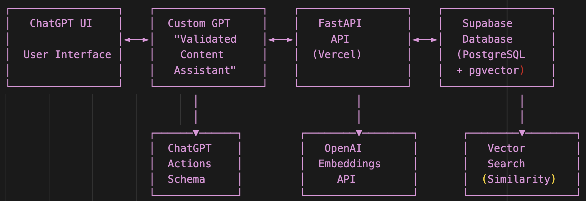

# Validated Content API

> A production-ready FastAPI backend powering semantic search over validated AI content using pgvector, Supabase, and ChatGPT Actions.

## Overview

A semantic search-enabled knowledge management system for validated AI content, built using ChatGPT Actions, FastAPI, and Supabase with vector embeddings.

## Architecture Diagram

<pre>
## Architecture Diagram

## Key Features

- Custom GPT integration via ChatGPT Actions
- RESTful API endpoints for managing and searching validated content
- OpenAI `text-embedding-ada-002` integration
- Supabase Postgres with `pgvector` extension
- Deployed on Vercel as serverless FastAPI functions
- Row-level security, CORS, and topic categorization

## API Endpoints

See full documentation here (coming soon or inline below):
- `POST /content` – Create content
- `GET /content` – List content
- `POST /search` – Semantic search
- `GET /topics` – Topic listing

## Deployment

- Vercel serverless backend
- Supabase for storage
- Environment variables stored securely
